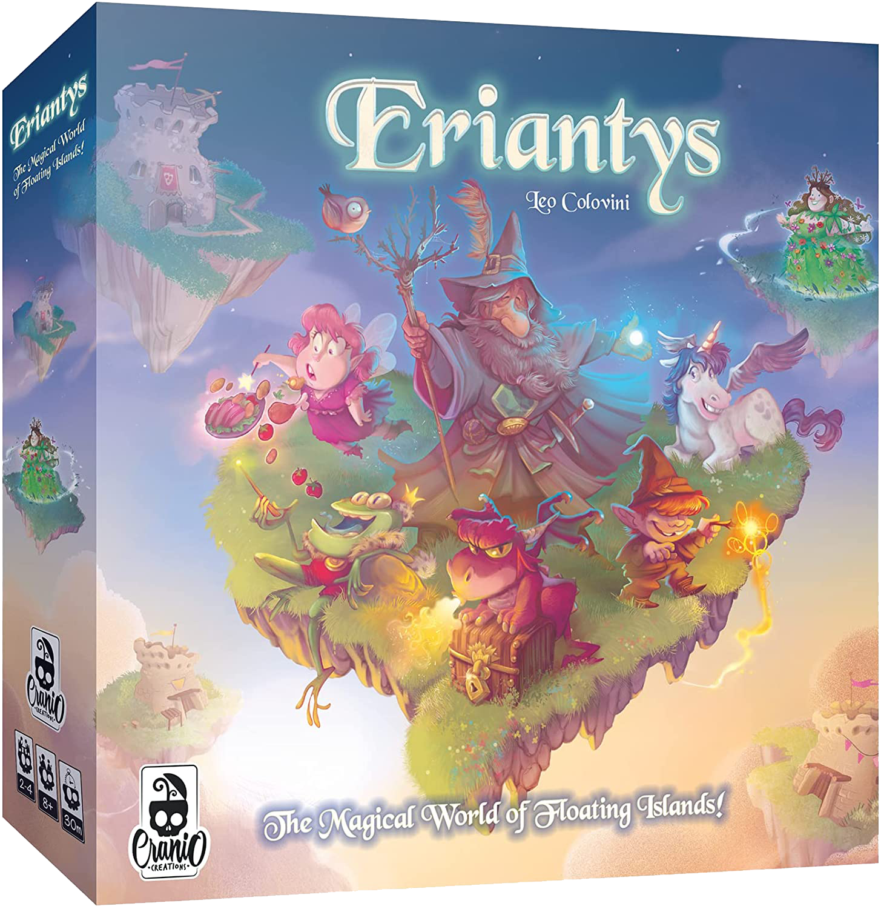

# ing-sw-2022-Shpakov-Stefanizzi-Tischer

* [The Game](#game)
* [Implemented Functionalities](#functionalities)
* [Installation](#installation)
* [Server](#server)
* [Client](#client)
* [How to play](#howtoplay)
* [Tools](#tools)
* [Test and Docs](#test)

 


## The Game <a name="game"></a>
This repository contains a **Java** version of the game [*Eriantys*](https://www.craniocreations.it/prodotto/eriantys/). The project has been developed for the course **Software Engineering** at Politecnico di Milano as a final part of examination for the Bachelor in Computer Engineering. The contributors were:
* [Mykhailo Shpakov](https://github.com/MykhailoShpakovPoliMi)
* [Giacomo Stefanizzi](https://github.com/jackstefa)
* [Alessandro Tischer](https://github.com/AlexTischer)

## Implemented Funcionalities <a name="functionalities"></a>
| Functionalities    |                      Status                       |
|:-------------------|:-------------------------------------------------:|
| Basic Rules        |                        🟩                         |
| Complete Rules     |                        🟩                         |
| Socket             |                        🟩                         |
| CLI                |                        🟩                         |
| GUI                |                        🟩                         |
| Character Cards    |                        🟩                         |
| Four Players Match |                        🟩                         |
| Multiple Matches   |                        🟥                         |
| Persistence        |                        🟥                         |
| Resilience         |                        🟩                         |

#### Legend
🟥Not Implemented &nbsp;&nbsp;&nbsp;&nbsp;
🟨Implementing&nbsp;&nbsp;&nbsp;&nbsp; 
🟩Implemented

## Installation <a name="installation"></a>
To start the game you need to download [JavaSE 18](https://www.oracle.com/it/java/technologies/javase-downloads.html) (or updated versions).

Download the repo as it follow
```bash
git clone https://github.com/AlexTischer/ing-sw-2022-Shpakov-Stefanizzi-Tischer.git
```
on linux. For Windows should be necessary download the repo in zip format and then unzip it.
The executable files are stored in the `/JARs` directory.

## How to start the server <a name="server"></a>

To start the server, open a terminal in the same directory of the Server.jar file and type:

```bash
java -jar Server.jar
```
This way the server will be listening to port 46582

You can also choose a custom port typing:
```bash
java -jar Server.jar #port
```
Now the server has started.

## How to start the client <a name="client"></a>
To start the server, open a terminal in the same directory of the Client.jar file and type:
```bash
java -jar Client.jar
```
This way the client will, by default, try to connect to `127.0.0.1 : 46582`

You can also choose a custom ip and port (or only ip) typing: 
```bash
java -jar Client.jar #ip #port
```

On startup, the client will _**first**_ ask you whether you want to play with GUI or with CLI _**and then**_ will try to connect to the (specified) `ip:port`

```bash
Do you want to use CLI or GUI?
cli
Connection established with server: /127.0.0.1:46582
```

## How to play<a name="howtoplay"></a>

Start the server and the clients (2, 3 or 4 of them): the first client that will connect to the server will configure the match, the others will only be asked to insert their name.
The first turn's order of play will be randomly generated by the server, as well as teams in case of a four players match.

You can find the english rules [here](/Documentation/eriantys_rules.pdf)

The game app is self-explainatory once you know the rules, and, anyway, you will be guided in every phase of your turn.

It is always possible _**rejoin**_ an already started match using the same `nickname` as before.

## Tools <a name="tools"></a>
In this project were used the following tools:
* [LucidChart](https://lucid.app/) - UML Diagram
* [Maven](https://maven.apache.org/) - Dependency Management
* [IntelliJ](https://www.jetbrains.com/idea/) - IDE
* [JavaFX](https://openjfx.io) - Graphical Framework


## Test and Documentation <a name="test"></a>
You can find the whole documentation [here](/Documentation).

The tests have reached the following coverage.


You can find the UMLs [here](/Documentation/UMLs). Unfortunately, due to an Intellij Idea known bug, 
we cannot export the complete lowlevel UML as an image. `.uml` file is included instead.